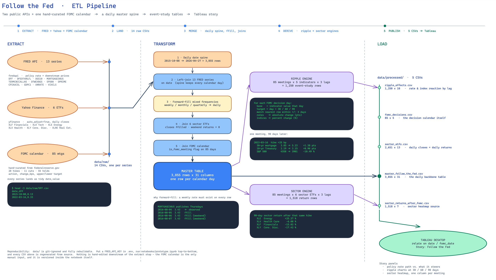

# Follow the Fed

### ▶ [**View the interactive story on Tableau Public**](https://public.tableau.com/views/FollowTheFed-StoryBoard/FullStory)

**When the Federal Reserve moves the interest rate, how long does it take to reach your mortgage, your credit card, and your portfolio — and which parts of the economy feel it first?**

This project turns that question into a reproducible data pipeline and a Tableau story. It pulls ~10.5 years of U.S. macro and market data from two public APIs, aligns 13 economic series that publish on four different schedules onto a single daily grid, and runs an event study around all **85 FOMC meetings** from October 2015 to March 2026.

*Data visualization final project — M.S. coursework. Built end to end: sourcing, pipeline, analysis, visual design.*

---

## The pipeline at a glance



*Editable source: [`docs/pipeline.excalidraw`](docs/pipeline.excalidraw) — open at [excalidraw.com](https://excalidraw.com).*

---

## What this project delivers

| | |
|---|---|
| **A daily backbone table** | 3,855 rows × 31 columns — one row per calendar day, every indicator present on every row |
| **An event-study engine** | 1,250 rows measuring how 5 rate/index indicators moved 30/60/90 days after each decision |
| **A sector reaction table** | 1,518 rows of sector-ETF returns after each decision, ready for a heatmap |
| **A visual story** | A published Tableau story board built on those CSVs — [view it live](https://public.tableau.com/views/FollowTheFed-StoryBoard/FullStory) |

---

## Data sources

| Source | What it provides | How it arrives |
|---|---|---|
| **FRED** (Federal Reserve Bank of St. Louis) | 13 series via `fredapi` — the policy rate, the prices it steers, and the macro context behind each decision | API, keyed |
| **Yahoo Finance** | 6 SPDR sector ETFs (`XLF` `XLK` `XLE` `XLV` `XLY` `XLRE`), adjusted daily closes | API via `yfinance` |
| **FOMC decision calendar** | 85 meetings — action, basis-point change, resulting target range | Hand-curated from federalreserve.gov, versioned inside the notebook |

**The 13 FRED series, grouped by role in the story:**

- **The lever** — `DFF` (effective fed funds rate), `DFEDTARU` / `DFEDTARL` (target range)
- **What it steers** — `MORTGAGE30US` (30-yr mortgage), `DGS10` (10-yr Treasury), `TERMCBCCALLNS` (credit-card APR), `DPRIME` (prime rate), `DTWEXBGS` (trade-weighted dollar), `SP500`
- **Why the Fed acts** — `CPIAUCSL` (inflation), `UNRATE` (unemployment), `GDPC1` (real GDP)
- **Market stress** — `VIXCLS` (volatility index)

**Window:** 2015-10-08 → 2026-04-27. The start date is deliberate — `XLRE` (Real Estate) was carved out as its own sector in October 2015, and the Fed had held rates at zero for seven straight years up to that point, so the window opens on a clean baseline just before the first hike of the cycle.

---

## How the pipeline works

**Extract.** Each FRED series is fetched and normalized to a tidy `date,value` frame, then landed in `data/raw/` as one CSV per series. ETF closes and daily returns land the same way. Every fetch is wrapped so one failing series doesn't kill the run, and a frequency audit reports the observed publication gap per series (daily / weekly / monthly / quarterly) before anything downstream is built.

**Transform.** The core problem is that these series don't share a calendar: the fed funds rate is daily, mortgage rates print weekly on Thursdays, CPI is monthly, GDP is quarterly. The pipeline solves it with a **date spine** — a continuous daily index every series is left-joined onto, then forward-filled. The result is the honest answer to "what was the 30-year mortgage rate on this day?": the most recent published number. Sector closes are forward-filled the same way; weekend *returns* are set to 0 rather than filled, since no trading happened. The FOMC calendar is joined last, adding an `is_fomc_meeting` flag plus the action and basis-point change.

**Derive.** Two engines read the master table:

- **Ripple engine** — for each meeting × indicator × lag (30/60/90 days), take the indicator's value on decision day, find the nearest observation to the target date within ±3 days, and compute the change. Rates are reported as absolute point moves ("mortgage +1.38 pts"), indices as percent moves ("S&P −10.49%") — matching how each is actually discussed.
- **Sector engine** — the same lookahead, applied to the six sector ETFs, producing a percent return per meeting × sector × lag.

**Load.** Five CSVs land in `data/processed/`, related in Tableau on `date` / `fomc_date`.

---

## What the data shows

Median moves in the **90 days after** a decision, across the full 2015–2026 window (20 hikes, 11 cuts, 54 holds):

| | After a hike | After a cut | After a hold |
|---|---:|---:|---:|
| 30-yr mortgage rate | **+0.19 pts** | −0.10 pts | −0.09 pts |
| Credit-card APR | **+0.35 pts** | −0.23 pts | +0.04 pts |
| 10-yr Treasury | +0.02 pts | +0.02 pts | −0.03 pts |
| S&P 500 | +1.95 % | +1.41 % | +5.15 % |

Median 90-day **sector** returns tell a sharper story than the index alone:

| Sector | After a hike | After a cut |
|---|---:|---:|
| Technology | +4.84 % | +6.01 % |
| Health Care | +1.94 % | +9.17 % |
| Consumer Discretionary | +1.72 % | +3.18 % |
| Real Estate | +0.92 % | +2.45 % |
| Energy | +0.41 % | +2.01 % |
| **Financials** | **−1.38 %** | +2.30 % |

Two things worth pointing a visualization at: **consumer borrowing costs track the Fed closely while the 10-year Treasury barely budges** — the long end prices expectations, not the current meeting — and **the sector spread is where the interesting variance lives**, with Financials the only sector whose median 90-day return is negative after a hike.

> These are co-movements around scheduled events, not causal estimates. Rate decisions are anticipated and priced in well before the announcement, and the 30/60/90-day windows overlap across consecutive meetings. The visualization is built to show *what followed*, and to be explicit that it isn't showing *what was caused*.

---

## Quickstart

```bash
git clone https://github.com/malithjd/FollowTheFed.git
cd FollowTheFed

python3 -m venv .venv && source .venv/bin/activate
pip install -r requirements.txt

cp .env.example .env          # then add your free FRED API key
```

Get a key in about a minute at [fredaccount.stlouisfed.org/apikeys](https://fredaccount.stlouisfed.org/apikeys), then:

```bash
jupyter lab notebooks/prototype.ipynb   # run top to bottom
```

The notebook rebuilds `data/raw/` and `data/processed/` from source in a couple of minutes. Both directories are git-ignored by design — this repo ships the *recipe*, not the leftovers.

**To rebuild the pipeline diagram** (optional): open `docs/pipeline.excalidraw` at [excalidraw.com](https://excalidraw.com) and export a PNG.

---

## Repository structure

```
FollowTheFed/
├── notebooks/
│   └── prototype.ipynb      # the full ETL: extract → transform → derive → load
├── data/
│   ├── raw/                 # 14 CSVs, one per source series   (git-ignored)
│   └── processed/           # 5 analysis-ready CSVs            (git-ignored)
├── docs/
│   ├── pipeline.excalidraw  # editable pipeline diagram
│   └── pipeline.png         # rendered version (embedded above)
├── Story/                   # story assets for the Tableau build
├── src/                     # reserved: notebook logic to be extracted here
├── tests/                   # reserved: pipeline assertions
├── requirements.txt
└── .env.example             # FRED_API_KEY=your_key
```

### Output data dictionary

| File | Shape | Grain | Feeds |
|---|---|---|---|
| `master_follow_the_fed.csv` | 3,855 × 31 | one calendar day | rate-path and context charts |
| `ripple_effects.csv` | 1,250 × 10 | meeting × indicator × lag | ripple charts |
| `sector_returns_after_fomc.csv` | 1,518 × 7 | meeting × sector × lag | sector heatmap |
| `fomc_decisions.csv` | 85 × 5 | one meeting | annotations, filters |
| `sector_etfs.csv` | 2,651 × 13 | one trading day | sector price detail |

---

## Engineering decisions worth calling out

- **A date spine instead of resampling.** Reindexing each series independently would have produced six different calendars that never line up. One spine, joined and forward-filled, gives every chart the same x-axis and makes the Tableau relationships trivial.
- **Forward-fill, not interpolation.** Interpolating a mortgage rate invents observations that were never published. Carrying the last print forward is what a borrower would actually have been quoted.
- **±3-day tolerance on the lookahead.** Day 30 after a meeting lands on a weekend roughly two times in seven. Rather than dropping those windows, the engine takes the nearest observation within three days — the alternative is silently losing ~28% of the event study.
- **Absolute vs. percent change, chosen per indicator.** A rate that goes from 3.85 to 5.23 moved *1.38 points*; an index that goes from 4358 to 3901 fell *10.49%*. Mixing the two on one axis is how misleading charts get made.
- **Weekend returns are 0, not forward-filled.** Filling them would fabricate six extra "flat trading days" per meeting window and bias any average return computed off the master table.
- **Data is git-ignored, the notebook is the source of truth.** Every CSV in the repo tree is reproducible from a single key and a single run, so the repo stays small and can never drift from its inputs.

---

## Tech stack

`Python 3.13` · `pandas` · `fredapi` · `yfinance` · `python-dotenv` · `Jupyter` · `Tableau Desktop` · `Excalidraw`

**Skills this project exercises:** API integration and rate-limited data collection · time-series alignment across mismatched publication frequencies · event-study design · reproducible, secret-safe pipeline structure · translating a macroeconomic question into a data model built for visual storytelling.

---

## Status

- [x] Extract — 13 FRED series, 6 sector ETFs, 85-meeting FOMC calendar
- [x] Transform — daily spine, forward-fill, ETF and calendar joins, master table
- [x] Derive — ripple engine and sector engine
- [x] Load — five analysis-ready CSVs
- [x] Tableau story — [published to Tableau Public](https://public.tableau.com/views/FollowTheFed-StoryBoard/FullStory); assets in `Story/`
- [ ] Extract notebook logic into `src/` modules with tests in `tests/`

### Known limitations

- The FOMC calendar is hand-curated; it needs a manual row appended after each new meeting.
- The last few meetings in the window have no complete 90-day forward horizon, so their long-lag rows are absent by design rather than zero.
- `TERMCBCCALLNS` (credit-card APR) is published quarterly despite FRED labelling it monthly, and CPI/unemployment carry a 61-day gap around the 43-day government shutdown — both are handled by forward-fill and flagged in the notebook.

---

## License & author

MIT — see [LICENSE](LICENSE).

**Malith Jayasinghe** · [github.com/malithjd](https://github.com/malithjd)

Data courtesy of the [Federal Reserve Bank of St. Louis (FRED)](https://fred.stlouisfed.org/) and Yahoo Finance. Not investment advice.
